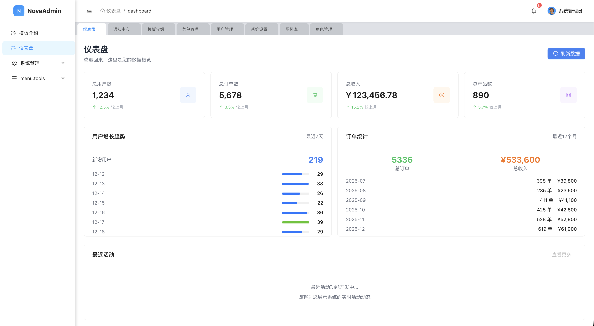

# NovaAdmin

企业级通用后台管理前端框架（开源）。基于 React + TypeScript + Vite 构建，内置权限、国际化、主题配置、Tab 导航、Mock 数据等常用能力，适合作为企业管理系统的基础脚手架。

[访问地址](https://bhabgs.com/nova-admin/#/)

- 核心特性

  - 账号登录、受保护路由与权限校验（基于角色/菜单）
  - 多语言与 RTL 支持（zh-CN / en-US / ar-SA）
  - 主题设置：浅/深色、主题色、圆角、布局（侧边栏折叠等）
  - 页签（Tab）管理、面包屑、页面容器与统一空态
  - Ant Design 5 + Tailwind 实用样式（tailwind-merge），可按需扩展
  - MSW 前端 Mock，开箱即可联调
  - 常用业务模块示例：用户、角色、菜单、仪表盘等

- 技术栈

  - React 18、React Router 7、TypeScript 5、Vite 6
  - Ant Design 5、@ant-design/charts
  - Redux Toolkit（含切片：auth/tabs/menu/role/settings/dashboard/user）
  - i18next + react-i18next
  - Axios（统一请求封装）+ MSW（Mock Service Worker）

- 快速开始

  1. 安装依赖（建议使用 pnpm）：
     - pnpm install
  2. 启动开发：
     - pnpm dev
  3. 构建生产：
     - pnpm build
  4. 预览构建产物：
     - pnpm preview
  5. 代码检查：
     - pnpm lint / pnpm check

- 预览截图

  > 以下截图文件位于 `public/` 目录，在构建后会一并打包到静态资源中。

  - 登录页

    

  - 仪表盘首页

    

  - 菜单管理

    

- 环境配置

  - .env.development / .env.production 中可配置后端 API 前缀等变量
  - Vite 配置位于 vite.config.ts

- 目录结构（节选）

  - src/
    - api/ 请求封装、模块 API 与 mock/
    - components/ 通用组件（PageContainer、ThemeSettings、CommonTable 等）
    - i18n/ 多语言初始化与词条
    - layouts/ 主布局（侧边栏/头部/内容）
    - pages/ 业务页面（Dashboard、User、Role、Menu、Settings 等）
    - router/ 路由、受保护路由、权限路由与路由表
    - store/ Redux Toolkit 仓库与切片
    - utils/ 常用工具（鉴权、格式化等）

- 架构说明

  - 路由与权限：PublicRoute/ProtectedRoute/PermissionRoute 组合，登录态与权限控制在路由层落地（配合菜单与角色）。
  - 状态管理：Redux Toolkit 切片负责模块状态；设置项（语言、主题、布局）持久化到 localStorage。
  - 国际化：i18next 初始化，支持多语言与 RTL 切换；文案在 locales/\*.json 中维护。
  - 主题与样式：AntD 5 主题 Token + Tailwind 实用类，ThemeSettings 提供一站式主题交互面板。
  - 数据与 Mock：统一请求在 api/request.ts，MSW 在 public/mockServiceWorker.js 与 src/api/mock/\* 提供前端假数据。

- 开发指南

  - 新增页面：在 pages/ 新建页面组件 → 在 router/routes.tsx 注册路由 → 在菜单数据（mock 或真实接口）里新增菜单项。
  - 新增菜单与权限：在 src/api/mock/menu.ts 增加菜单条目（真实项目由后端返回），前端根据用户角色与菜单生成可见路由与导航。
  - 国际化：在 i18n/locales 下为不同语言添加 key；页面通过 useTranslation 获取文案。
  - 主题设置：通过 ThemeSettings 组件或 settingsSlice 修改主题、颜色与圆角等。

- 许可证
  - MIT License

欢迎基于 NovaAdmin 快速搭建你的企业级后台管理系统，并按需扩展业务模块与设计语言。
